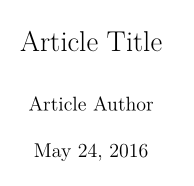
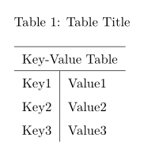

#LaTeX-Code-Collection

Some Basic code scripts when using latex.

Recommand to enable word wrap when using vim as an editor:
``` vim
set fo+=mM  
set wrapmargin=1
```
and stylize the line by `gqq`

## Preamble
Some useful settings.

## Title
Code: __title.tex__  
Result:  


## Enumerate
Code: __enumerate.tex__  
Result:  


## Figures
Code: __figure.tex__  
Result:  


## Table
Code: __table.tex__  
Result:  


## Reference
Code: __reference.tex__, __bibliography.bib__  
Result:  
